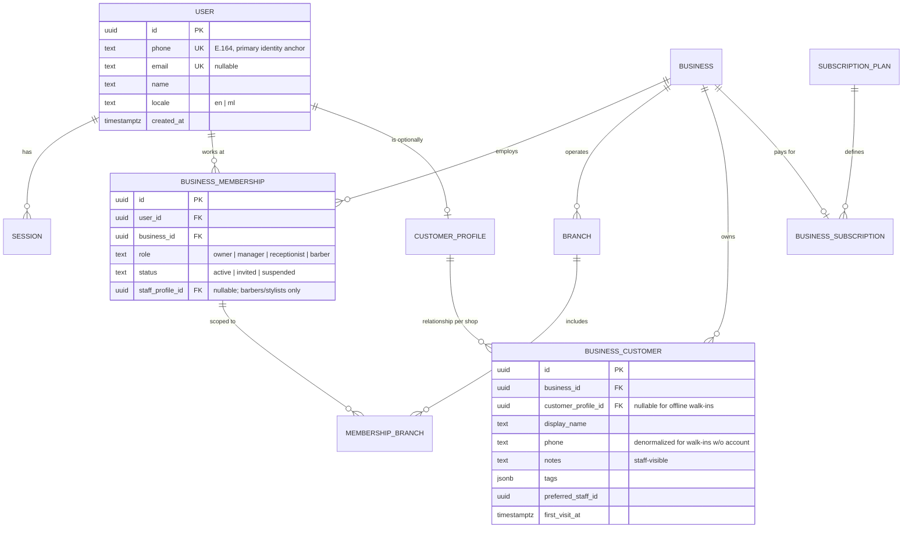
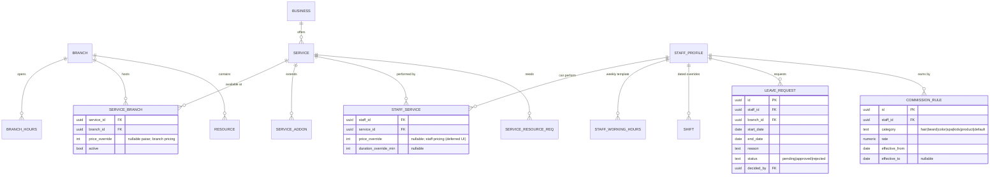
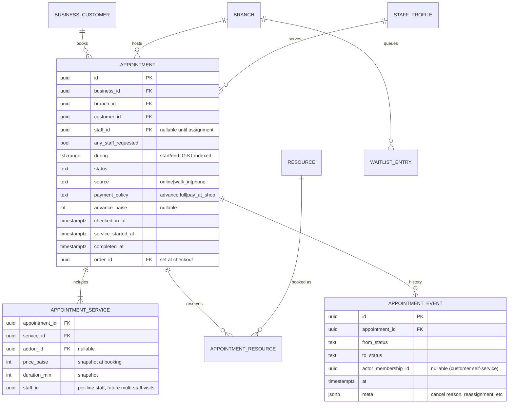
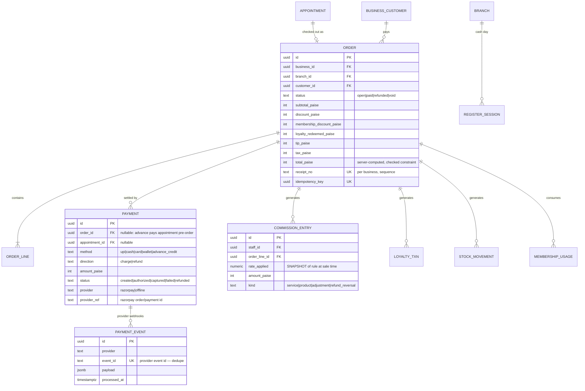

# Domain Model

> Derived from actual demo usage (`lib/types.ts`, `lib/store.ts` actions,
> `lib/selectors.ts` reads), not from the wishlist. Every entity below is
> justified by a demo behavior; entities the demo doesn't exercise are marked
> **deferred**.

---

## 1. Identity & tenancy core

The demo's `role: "customer" | "barber" | …` persona model is a UI concept
only. Production separates *who you are* from *what you are to a business*.



**Key decisions**

1. **Tenant boundary = `business_id`.** Every tenant-scoped table carries it
   (even where derivable via joins) so isolation, RLS and future partitioning
   are single-column concerns. `branch_id` is a second scoping dimension
   within a tenant — the demo's owner branch-filter and manager single-branch
   views prove both are needed.
2. **A user is not a role.** The same phone number may hold a
   `CUSTOMER_PROFILE`, a `barber` membership at shop A and an `owner`
   membership at shop B. The demo persona switcher becomes, in production, a
   *context switcher across memberships*.
3. **Customer identity is global, customer relationship is per-business.**
   `CUSTOMER_PROFILE` (global, keyed by phone via USER) enables the future
   marketplace ("my bookings across shops"); `BUSINESS_CUSTOMER` owns
   everything the shop created: notes (`addCustomerNote` in the demo),
   tags, preferences, loyalty, visit stats. A shop can have customers with
   **no** global profile (front-desk walk-in "Shafi" with just a name —
   exactly what `addWalkIn` creates today). Shops never see each other's
   `BUSINESS_CUSTOMER` rows even for the same person.
4. `staff_profile_id` hangs off the membership, not the user — staff data
   (bio, rating, commission rules) is tenant-owned.

## 2. Catalog & staffing

Demo evidence: services have per-branch presence (`Service.branchIds`),
durations drive scheduling, staff have `serviceIds` capability lists,
per-category commission rules, weekly `workingHours`, and resources exist with
`requiresResourceType` on services (Facial→room).



- `SERVICE_BRANCH.price_override` + `STAFF_SERVICE.price_override` give
  branch- and staff-level pricing (§32 requirement) without duplicating the
  catalog. Base price lives on `SERVICE`.
- **`COMMISSION_RULE` is effective-dated.** The demo's
  `commissionForInvoice()` recomputes history with current rates — a known
  flaw. Production *snapshots* the applied rule into `COMMISSION_ENTRY` at
  checkout time (§6) and rules carry `effective_from/to` so past invoices are
  never re-rated.
- Weekly template (`STAFF_WORKING_HOURS`) + dated `SHIFT` overrides + approved
  `LEAVE_REQUEST` are the three availability inputs the demo engine already
  consumes; `SHIFT.status` keeps the demo's `working|break|leave|off|overtime`.

## 3. Scheduling & queue

Demo evidence: `Appointment` holds `serviceIds[]`, `staffId | null` (any-barber),
demo statuses `waitlisted|confirmed|checked-in|waiting|in-service|completed|cancelled|no-show`,
`source online|walk-in|phone`, advance fields, queue fields, and timestamps per
transition. `WaitlistEntry` exists and converts on cancellation.

> **Canonical production statuses** (resolved in Phase 0A): the demo's
> separate `waiting` status is **not persisted** in production — a customer
> who has checked in *is* waiting; "Waiting" is a queue projection over
> `checked_in` (ordered by `queue_position`, anchored to
> `service_started_at ?? checked_in_at` — the QA-proven rule). The demo
> adapter's internal `waiting` string maps to production `checked_in`.
> `pending_payment` and `expired` are added for online-payment holds.



**Queue is a projection, not a table.** The demo's `queueForBranch()` derives
the live queue from appointment state — and QA proved the correct anchor is
`service_started_at ?? checked_in_at`, not the slot date. Production keeps the
queue as a *query over appointments* (status ∈ {checked_in,
in_service} anchored to today's check-in), plus `queue_position` assigned at
check-in for stable ordering. A separate `QUEUE_ENTRY` table is **rejected**:
it would duplicate appointment state and invite drift — walk-ins are just
appointments with `source='walk_in'` and `during` = now (exactly how
`addWalkIn` works today). `APPOINTMENT_EVENT` provides the status history that
the demo lacks.

Canonical state machine (persisted statuses only):

```text
waitlisted ──────────────► confirmed
pending_payment ─┬───────► confirmed        (payment captured in time)
                 ├───────► expired          (10-min TTL job; capacity freed)
                 └───────► cancelled
confirmed ───────┬───────► checked_in       (sets queue_position; enters queue projection)
                 ├───────► cancelled
                 └───────► no_show
checked_in ──────┬───────► in_service
                 ├───────► no_show          (abandoned queue after N min, job-driven)
                 └───────► cancelled        (rare; refund path)
in_service ──────────────► completed
```

`waiting` is deliberately absent — it is the queue projection of
`checked_in`, never a stored status. Terminal: `completed`, `cancelled`,
`no_show`, `expired`.

## 4. Orders, payments, money

Demo evidence: `Invoice` with lineItems (service|product|addon, per-line
staffId), subtotal, discount, membershipDiscount, loyaltyRedeemed, tip,
total, multi-method `paymentMethods[]` including `advance`, receiptNumber;
register closing computes expected vs actual cash.



**Financial vocabulary** (owner reports must distinguish — demo currently
blends some of these):

| Term | Definition | Source |
|---|---|---|
| Booking value | Σ snapshot prices of booked services | APPOINTMENT_SERVICE |
| Gross sales | Σ ORDER.subtotal of paid orders | ORDER |
| Discounts | promo + membership + loyalty redemption | ORDER columns (separately) |
| Collected | Σ captured PAYMENT charges − refunds | PAYMENT |
| Outstanding | paid-at-shop orders still `open` | ORDER |
| Tips | pass-through to staff, excluded from revenue | ORDER.tip_paise |
| Advance | PAYMENT on appointment pre-order; becomes `advance_credit` allocation at checkout | PAYMENT |
| Estimated profit | collected − EXPENSE (clearly labeled estimate, as demo does) | derived |

## 5. Ledgers (loyalty, stock, membership usage)

Production replaces the demo's three mutable numbers with append-only ledgers.
Cached balances are allowed but must be reconcilable by summation.

**When each ledger row is written** (resolved in Phase 0A — no side effect
runs at both stages):

| Side effect | Service completion txn | Checkout txn |
|---|---|---|
| Appointment status transition | ✅ `in_service→completed` | — (`order_id` backlink only) |
| STOCK_MOVEMENT `service_consumption` | ✅ | ❌ never |
| STOCK_MOVEMENT `product_sale` | ❌ | ✅ |
| "Ready for checkout" visibility / event | ✅ (outbox `service.completed`) | — |
| ORDER + lines + receipt sequence | ❌ | ✅ |
| MEMBERSHIP_USAGE | ❌ | ✅ |
| LOYALTY_TXN redeem **and** earn | ❌ | ✅ |
| COMMISSION_ENTRY (rule snapshot) | ❌ | ✅ |
| Advance allocation + PAYMENT rows | ❌ | ✅ |
| Revenue recognition | ❌ | ✅ (order paid) |

```text
LOYALTY_TXN(id, business_id, customer_id, points_delta, kind: earn|redeem|bonus|expire|adjust,
            order_id?, reason, created_at)
  → LOYALTY_ACCOUNT(customer_id, cached_points, updated_at)  -- CHECK cached = Σ deltas (reconciliation job)

STOCK_MOVEMENT(id, business_id, branch_id, item_id, qty_delta, kind:
               purchase_receipt|service_consumption|product_sale|adjustment|return|damage,
               ref_order_id?|ref_po_id?, actor, created_at)
  → INVENTORY_ITEM.cached_qty

MEMBERSHIP_USAGE(id, customer_membership_id, service_id, order_id, cycle_start, used_at)
  → remaining = plan.qty − COUNT(usage in current cycle)   -- no mutable counter at all
```

The demo already computes exactly these deltas (loyalty earn = ⌊total/10⌋,
`consumedPerService` map, membership free-unit consumption in `checkout`) —
production just *records* them instead of overwriting integers.

## 6. Remaining tenant entities

| Entity | Demo source | Notes |
|---|---|---|
| MEMBERSHIP_PLAN / CUSTOMER_MEMBERSHIP | `MEMBERSHIP_PLANS`, `memberships[]` | plan holds included `{service, qty}` + discount %, membership holds cycle dates |
| OFFER / COUPON | `offers[]` with code, audience, window | redemption count via ORDER link (deferred: per-customer limits) |
| CAMPAIGN / CAMPAIGN_DELIVERY | `campaigns[]` + `sendCampaign` | delivery rows created by worker per recipient, with provider message id + status |
| REVIEW / response | `reviews[]`, `respondToReview` | link to appointment; response inline column is fine |
| EXPENSE | `expenses[]` | category enum from demo |
| REGISTER_SESSION | `closeRegister` | open/close with expected vs counted cash |
| VENDOR / PURCHASE_ORDER / PO_ITEM | `createPurchaseOrder`, `receivePurchaseOrder` | receipt creates STOCK_MOVEMENTs, status guard prevents double-receive |
| NOTIFICATION | `notifications[]` per role | production: per-user rows + NOTIFICATION_PREFERENCE |
| SUPPORT_TICKET, AUDIT_LOG, FEATURE_FLAG | admin area / new | platform-scoped, not tenant tables |

**Deferred (no demo behavior yet):** Attendance punch-in, ServicePrice history
table (start with columns + audit log), CustomerSegment materialization
(compute on read as demo does), Reward catalog (demo rewards are static UI).

## 7. Invariants and where each is enforced

| # | Invariant | Enforcement |
|---|---|---|
| 1 | No overlapping appointments per staff | **DB**: `EXCLUDE USING gist (staff_id WITH =, during WITH &&) WHERE (status IN ('pending_payment','confirmed','checked_in','in_service'))` — a live `pending_payment` hold **consumes capacity**; plus service-layer pre-check for friendly errors |
| 1b | Payment holds expire | **Job + status guard**: `appointment.expire_pending_payment` runs every minute, `UPDATE … SET status='expired' WHERE status='pending_payment' AND created_at < now()-'10 min'` — leaving the exclusion set frees the slot atomically. A payment webhook that arrives *after* expiry finds the guard `WHERE status='pending_payment'` failing → the capture is recorded, the customer is auto-refunded (or offered the next slot) via the payments module; money is never silently kept |
| 2 | No double-booked resource | **DB**: same pattern on APPOINTMENT_RESOURCE (resource_id, during) |
| 3 | Checkout charged once despite client retry | **Idempotency key** unique on ORDER + API replay returns original response |
| 4 | Completing a service twice must not double loyalty/stock/commission | **Transaction + status guard**: `UPDATE appointment SET status='completed' WHERE id=$1 AND status='in_service'`; affected-rows≠1 → 409; all fan-out in same txn |
| 5 | PO received once | **Status guard** same pattern (`WHERE status='ordered'`) |
| 6 | Payment webhook processed once | **DB**: PAYMENT_EVENT `UNIQUE(provider, event_id)`; insert-first, process-after |
| 7 | Approved leave removes availability | **Service layer**: availability engine consumes leave (already true in `packages/domain`); DB CHECK not possible |
| 8 | Cancellation releases capacity | falls out of #1's `WHERE status IN (...)` predicate — cancelled rows leave the exclusion set automatically |
| 9 | Membership usage never exceeds plan qty | **Transaction**: `INSERT usage` + `SELECT COUNT(*) FOR UPDATE`-free check via unique partial approach is impossible → use `SERIALIZABLE`-lite: advisory lock on (membership_id) inside checkout txn, or a CHECK via trigger; recommended: advisory lock (checkout already single-txn) |
| 10 | Loyalty balance ≥ 0 | **DB CHECK** on cached balance + txn recomputes before commit |
| 11 | Order totals consistent | **DB CHECK**: `total = subtotal - discount - membership_discount - loyalty_redeemed + tip + tax`; server computes, client only previews |
| 12 | Tenant isolation | guard + scoped repos + **RLS backstop** (SECURITY_AND_TENANCY.md) |
| 13 | Receipt numbers gapless per business | per-business sequence table incremented in checkout txn |

Distributed locks are **not needed**: a single Postgres, single-region API,
and advisory locks inside transactions cover every case above.

## 8. ID & money conventions

- All PKs `uuid` v7 (time-ordered, index-friendly).
- All money in **integer paise**; the demo's rupee floats are display-only.
- All timestamps `timestamptz`; business timezone column on BRANCH
  (`Asia/Kolkata` default) for day-bucketing analytics.
- Soft-delete only where UX needs undo (services, staff); hard rows elsewhere
  with status enums.
