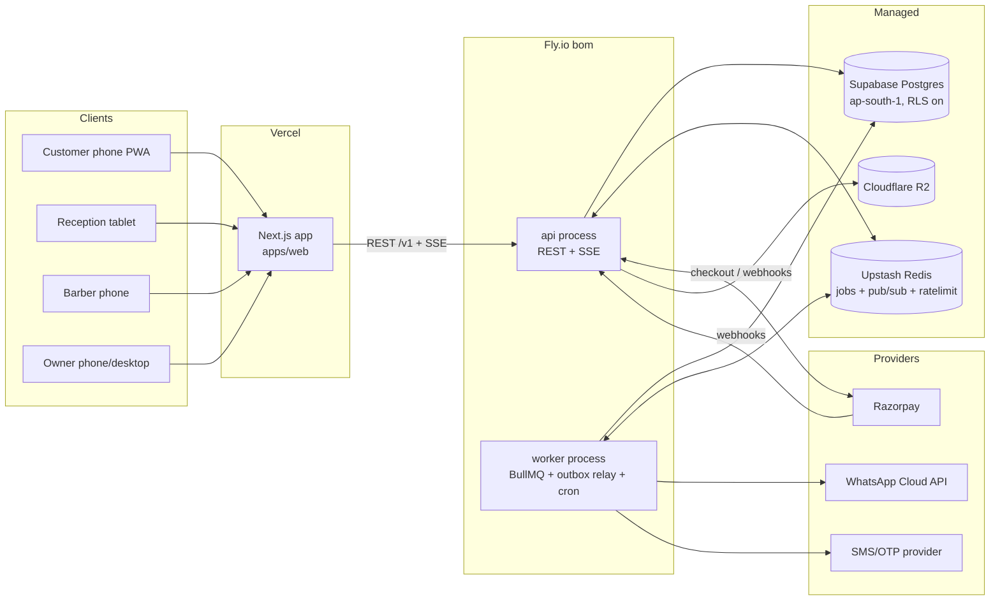

# Production Architecture

> Phase 2 blueprint. Baseline: tag `demo-v1` (commit `59aa115`), live at
> barber-os-lemon.vercel.app. This document records what the demo actually is,
> compares production options, and commits to one architecture.

---

## 1. What exists today (audited)

### 1.1 Shape of the demo

| Layer | Implementation | Files |
|---|---|---|
| UI | Next.js 16 App Router, 83 routes, 6 persona areas | `app/**` |
| Shells | `MobileAppShell` (customer, barber), `DashboardShell` (reception, manager, owner, admin) | `components/shell/app-shell.tsx` |
| State | One persisted Zustand store; every role reads/writes the same `DemoData` | `lib/store.ts` |
| Domain data | 25+ TS types (Appointment, Invoice, Membership, LoyaltyAccount, InventoryItem, LeaveRequest, …) | `lib/types.ts` |
| Seed | Deterministic RNG seed relative to "now"; 4 branches, 14 staff, ~200 customers, 32 days history | `lib/data/*` |
| Scheduling | Pure functions: duration-aware slot computation honoring working hours, branch hours, approved leave, existing bookings | `lib/availability.ts` |
| Derived reads | Queue view w/ wait simulation, revenue/staff/service metrics, segments, deterministic insights | `lib/selectors.ts` |
| Personas/permissions | Static persona map + role→capability matrix (frontend-only gating) | `lib/personas.ts` |
| Tests | Data-layer smoke (`scripts/flow-test.mts`) + 23-assertion cross-role storyline (`scripts/storyline-test.mts`) | `scripts/` |

### 1.2 The 37 store actions = the product's write surface

The Zustand store is effectively the demo's "backend API". Its actions are the
authoritative inventory of commands production must support:

- **Session**: `enterRole`, `exitDemo`, `setOwnerBranchFilter`, `setActiveBranch`, `setLanguage`, `resetDemo`
- **Booking**: `createBooking`, `cancelAppointment`, `rescheduleAppointment`
- **Front desk**: `checkIn`, `addWalkIn`, `assignStaff`
- **Service lifecycle**: `startService`, `completeService`, `markNoShow`, `toggleBreak`, `addCustomerNote`
- **Checkout**: `checkout` (advance adjust, membership free-units + % product discount, loyalty redeem/earn, tip, split payments, product stock decrement)
- **Staff ops**: `requestLeave`, `decideLeave`
- **Inventory**: `createPurchaseOrder`, `receivePurchaseOrder`, `adjustStock`
- **Waitlist**: `joinWaitlist`, `resolveWaitlist`
- **Growth**: `respondToReview`, `createOffer`, `toggleOffer`, `createCampaign`, `sendCampaign`
- **Misc**: notifications CRUD, `toggleFavoriteBranch`, `upsertCustomer`, `closeRegister`

### 1.3 Behavior the demo has already proven (do not redesign casually)

1. **Duration-aware scheduling.** Slots are computed on a 15-min grid but a
   90-min Hair Colour only appears where 90 contiguous free minutes exist for
   an *eligible* staff member. "Any barber" merges per-staff availability and
   resolves to a concrete staff member per slot.
2. **Queue anchored to check-in reality, not slot date.** QA proved slot-date
   anchoring breaks after-hours check-ins; `queueForBranch` now anchors to
   `serviceStartedAt ?? checkedInAt ?? start`. This is a business rule, carry
   it into production (§ queue semantics in REALTIME_AND_EVENTS.md and
   DOMAIN_MODEL.md).
3. **Completion has fan-out.** `completeService` mutates appointment status +
   consumes mapped inventory + notifies reception. `checkout` computes
   advance-deduction, membership entitlements, loyalty redeem+earn, tip, stock
   decrement, and revenue in one atomic step. Production must keep this
   *atomic* — the storyline test pins the exact math.
4. **Leave → availability.** Approving leave flips shift rows and removes the
   staff member's slots. Availability must consume leave/shift state.
5. **Branch scoping everywhere.** Every selector takes a `branchFilter`;
   owner metrics re-scope live. Branch is a first-class dimension, not a tag.
6. **Wait estimation is a simulation**, not a constant: it assigns each
   waiting entry to its preferred barber's forecast free-time (or the
   earliest-free chair for "any") and accumulates durations.

### 1.4 What the demo is NOT (gaps production must fill)

- No authority: every "calculation" runs on the untrusted client.
- No identity: personas are hard-bound to seed IDs (`cu_danish`, `st_akhil`).
- No tenancy: one business, cross-business isolation never exercised.
- No concurrency: single browser tab; no double-booking protection.
- No ledgers: loyalty points and stock are mutable integers (history exists
  only for Danish's seeded loyalty); commission is recomputed from invoices
  with *today's* rules (`commissionForInvoice`), which is wrong for history.
- No money: payments are timed `setTimeout` theatrics (correctly labeled).
- No realtime: cross-role sync works only because all roles share one
  localStorage.

---

## 2. Architecture options considered

### Option A — Next.js full-stack (route handlers + server actions on Vercel)

* ✅ One repo, one deploy, fastest to start; server actions pair well with the existing forms.
* ❌ Vercel functions are a poor home for the rest of the system: no long-lived
  WebSocket/SSE at the free/low tiers, cron+queue requires stitching external
  services (QStash/Inngest), and background workers (reminders, WhatsApp retries,
  reconciliation) end up scattered across vendors.
* ❌ Couples API release cadence to frontend deploys; harder to add a future
  native app or third-party API consumers cleanly.
* ❌ India latency: Vercel functions won't sit next to a Mumbai Postgres.

### Option B — Next.js frontend + FastAPI backend

* ✅ Python ecosystem for future ML/analytics.
* ❌ Splits the codebase across two languages for a 1–3 dev team; loses direct
  reuse of the **already-written and already-tested TypeScript scheduling
  engine** (`lib/availability.ts`) and the shared domain types; duplicated
  validation contracts.
* ❌ No compelling Python-only requirement exists in the audited feature set.

### Option C — Next.js frontend + dedicated TypeScript modular monolith ✅ RECOMMENDED

* ✅ One language end-to-end; `lib/availability.ts`, pricing/checkout math and
  the domain types move into a shared package and run server-side unchanged —
  the storyline test becomes a backend integration test.
* ✅ One deployable service (API + SSE + worker as processes of the same
  codebase) = simple ops at 10 shops, clean module seams for 10,000.
* ✅ Long-lived processes: SSE/WebSocket, BullMQ workers, cron — no vendor
  stitching.
* ✅ Frontend stays on Vercel untouched during migration (see
  DEMO_TO_PRODUCTION_MIGRATION.md).

**Decision: Option C.**

---

## 3. Recommended production stack

| Concern | Choice | Rationale |
|---|---|---|
| Monorepo | pnpm workspaces + Turborepo | share `contracts` + `domain` packages between web and api |
| Frontend | Next.js on Vercel (unchanged) | already built, PWA-ready |
| Backend framework | **NestJS (Fastify adapter)** | boring, documented, DI + guards map 1:1 to tenancy/auth interceptors; module system enforces the seams below; easy to hire for |
| DB | **PostgreSQL 16** (Supabase managed, **Mumbai / ap-south-1**, used as plain Postgres — no client-side Supabase SDK) | PITR backups, branching for staging; RLS available as defense-in-depth |
| DB access | **Drizzle ORM + hand-written SQL migrations** | we *need* raw Postgres features: `EXCLUDE USING gist` for overlap prevention, partial unique indexes, `tstzrange`, RLS policies — Drizzle stays out of the way |
| Cache/queue/pubsub | **Redis (Upstash, ap-south-1)** | BullMQ jobs, SSE fan-out pub/sub, rate limiting |
| Jobs | **BullMQ** worker process (same codebase, `apps/api` `--worker` entrypoint) | reminders, WhatsApp delivery, outbox relay, reconciliation |
| Realtime | **SSE from the API** (per-branch topics), Redis pub/sub across instances; 30s polling fallback | see REALTIME_AND_EVENTS.md; no third realtime vendor at this scale |
| API hosting | **Fly.io, `bom` (Mumbai) region** — `api` + `worker` processes | API physically next to the DB; scale = add machines |
| Payments | **Razorpay** behind a `PaymentProvider` port | best-documented Indian gateway, reliable webhooks, UPI + cards, UPI AutoPay for future SaaS billing (verified Aug 2026 — see sources in PR description) |
| WhatsApp | **Meta WhatsApp Cloud API** behind a `MessageProvider` port (utility templates ≈ ₹0.13/msg in India); a low-markup BSP is an acceptable v1 shortcut | see REALTIME_AND_EVENTS.md §jobs |
| Object storage | Cloudflare R2 | shop logos, receipts PDF later; zero egress fees |
| Auth | DB-backed opaque sessions (httpOnly cookie for web) + phone OTP; details in SECURITY_AND_TENANCY.md | "logout all devices" & session history fall out naturally |
| Observability | Sentry (errors, web+api) + Axiom or Better Stack (structured logs) + Fly metrics | small, predictable bills |
| CI | GitHub Actions: lint, typecheck, unit, storyline-integration, migration dry-run | repo already has the test seeds |

### 3.1 Monorepo layout

```text
saloq/
├── apps/
│   ├── web/            # today's Next.js app (moved, not rewritten)
│   └── api/            # NestJS modular monolith
│       └── src/modules/
│           ├── auth/            # OTP, sessions, devices
│           ├── identity/        # users, memberships, customer profiles
│           ├── tenancy/         # guards, tenant context, RLS session vars
│           ├── catalog/         # services, addons, resources, pricing
│           ├── scheduling/      # availability, appointments, waitlist
│           ├── queue/           # live queue projection + commands
│           ├── orders/          # POS orders, invoices, register
│           ├── payments/        # provider port, webhooks, ledger
│           ├── loyalty/         # ledger + rewards
│           ├── memberships/     # plans, subscriptions, usage
│           ├── inventory/       # items, stock movements, POs, vendors
│           ├── staff-ops/       # shifts, leave, attendance, commissions
│           ├── crm/             # business-customers, notes, tags, segments
│           ├── notifications/   # policy → message jobs → provider ports
│           ├── marketing/       # offers, campaigns
│           ├── analytics/       # read models, owner dashboard queries
│           ├── admin/           # platform: tenants, subscriptions, support
│           └── audit/           # append-only audit log
├── packages/
│   ├── domain/         # PURE TS: availability engine, pricing/checkout math,
│   │                   # queue estimation — extracted from apps/web/lib,
│   │                   # imported by BOTH web (preview) and api (authority)
│   └── contracts/      # zod schemas per endpoint → OpenAPI + typed client
└── docs/architecture/  # these documents
```

**Module rules (the seams):**
- Modules own their tables; cross-module access goes through the owning
  module's service, never raw table joins across boundaries (exception:
  read-only analytics module, which is explicitly allowed cross-module SELECTs).
- Repository classes require a `TenantContext` (business_id + optional
  branch scope + acting membership) constructor-injected per request.
- Side effects across modules use in-process domain events + transactional
  outbox (REALTIME_AND_EVENTS.md), so any module can later be extracted to a
  service without changing its contract.

### 3.2 Scale staging

| Stage | Topology change |
|---|---|
| 10 shops | 1 Fly machine (api), 1 (worker), Supabase small, Upstash free — everything above already fits |
| 100 shops | 2× api machines (SSE via Redis pub/sub already multi-instance-safe); enable read replica for analytics queries |
| 1,000 shops | dedicated analytics read model (materialized views refreshed by worker); Postgres up-size; consider extracting `notifications` worker fleet |
| 10,000 shops | partition hot tables (`appointments`, `stock_movements`, `loyalty_transactions`) by `business_id` hash or time; candidate service extraction along module seams: payments, notifications, analytics; OLAP (ClickHouse) only if owner-analytics query latency demands it |

Nothing in the 10-shop design has to be thrown away at any stage; only added to.

---

## 4. Deployment topology



Environments: `production` and `staging` are separate Fly apps + separate
Supabase projects + separate Razorpay/WhatsApp credentials. No shared
resources between them, ever.

---

## 5. What deliberately does NOT exist in this architecture

- No microservices, no Kafka, no Kubernetes, no event sourcing.
- No GraphQL (REST + zod contracts + generated client covers a 1–3 dev team;
  revisit only if a marketplace client with wildly different read shapes appears).
- No client-side database SDKs (all data access via the API; RLS is a backstop,
  not the primary authorization mechanism).
- No separate analytics store until measured pain (see §22 strategy in
  PRODUCTION_ROADMAP.md).
