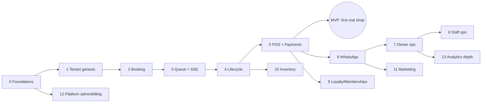

# Production Roadmap

> Vertical slices; each phase ends with something a real shop (or we,
> operating staging) can use. The demo keeps working throughout — the demo
> adapter is never deleted. Sequencing was re-derived from the audit rather
> than copied from the brief: payments moved *after* the queue/lifecycle
> slice because a Kerala shop can run on pay-at-shop + recorded UPI from day
> one, while a desk that can't see the live queue can't run at all.

## Phase 0 — Foundations (no product features)

Monorepo restructure (`apps/web`, `apps/api`, `packages/domain`,
`packages/contracts`); extract availability/pricing/queue math into
`packages/domain` with the existing tests moved over; Postgres schema core
(identity, tenancy, audit, outbox, sessions); OTP auth + sessions + guards;
RLS policies; CI (lint/typecheck/unit/migration-dry-run); staging + prod
environments on Fly/Supabase/Upstash; Sentry + logs.

*Exit test:* login with OTP on staging, memberships enforced, cross-tenant
404s proven by an isolation test suite.
*Risk:* monorepo move breaks Vercel build — do it as its own PR with zero
code changes beyond paths.

## Phase 1 — Tenant genesis: business, branches, services, staff

Business creation via existing `/onboarding` wizard (it becomes real signup);
branch hours; service catalog + addons + branch overrides; staff CRUD +
working hours + capabilities; resources. Effective-dated commission rules
(written now, used in Phase 5).

*Exit:* a real shop can be configured end-to-end by us on staging.
*Depends:* 0.

## Phase 2 — Availability + customer booking (first api-adapter flip)

`GET availability` (engine from `packages/domain` over real tables);
`POST appointments` with EXCLUDE-constraint overlap safety + idempotency +
pending-payment TTL (TTL path dormant until Phase 5 — bookings start as
pay-at-shop/confirmed); customer `/me` bookings; cancel/reschedule; waitlist
rows. Public shop page + `/shops/[slug]/book` flipped to api adapter.
Basic booking-confirmation WhatsApp **deferred** to Phase 6 — manual for now.

*Exit:* a customer phone books a real slot; double-booking torture test (two
parallel POSTs, one 409) passes in CI.
*Risk:* concurrency; mitigated by DB constraint + integration test, not app
logic.

## Phase 3 — Front desk: check-in, walk-ins, queue, SSE

Check-in/assign/no-show commands with status guards + APPOINTMENT_EVENT;
walk-in creation; queue projection endpoint (check-in-anchored — preserve the
QA-proven rule); SSE gateway + Redis pub/sub + outbox relay (first async
infra); reception Today/Queue/Check-in flipped.

*Exit:* booking on one phone appears on reception tablet ≤2s; queue reorders
live.
*Depends:* 2. *Risk:* SSE infra newness — polling fallback ships same phase.

## Phase 4 — Barber service lifecycle

start/complete with transactional stock consumption + outbox; barber Today/
Queue/customer-profile flipped; customer live-queue tracker on SSE; abandoned
queue job; break toggle via SHIFT.

*Exit:* full Customer→Reception→Barber chain live on staging devices;
completion is idempotent under double-tap (409 second time).

## Phase 5 — POS, orders, payments (MVP-closing slice)

Order preview/commit (server math: membership entitlements, loyalty
redeem/earn, advance credit, tip, split), receipt sequence, ledgers
(LOYALTY_TXN, STOCK_MOVEMENT for product sales, COMMISSION_ENTRY,
MEMBERSHIP_USAGE); register sessions + closing; Razorpay integration for
₹100 advance + optional full prepay + webhook pipeline + reconcile job;
POS + payments + closing screens flipped; storyline server-twin test green.

*Exit:* **MVP boundary reached** — see below.
*Risk:* money math regressions — the demo checkout tests are the spec;
port them first.

## Phase 6 — Notifications & WhatsApp

Notification policy layer, EXTERNAL_MESSAGE, WhatsApp Cloud API adapter
(booking confirmation, reminder T-60, cancellation, waitlist-open, receipt),
Malayalam templates, reminder cron, in-app notification rows.

## Phase 7 — Owner daily operation

Dashboard summary endpoint (one round-trip), revenue trend, live-shop via
SSE, alerts (low stock threshold events, pending leave), insights v1
(deterministic rules from `businessInsights`, server-side). Owner home +
analytics(basic) flipped.

## Phase 8 — Staff ops: leave, shifts, earnings

Leave request/approve (already spec'd), shift editor (the demo's read-only
grid becomes editable), staff earnings/commission statements from
COMMISSION_ENTRY. Manager area flipped.

## Phase 9 — Loyalty & memberships (customer growth)

Full loyalty UI on ledger, membership purchase/renewal job, usage displays,
membership sales at POS.

## Phase 10 — Inventory & purchasing

Items, movements ledger UI, vendors, POs + receive, low-stock automation,
consumption analytics. (Basic consumption already live since Phase 4/5.)

## Phase 11 — Marketing

Offers with real redemption at POS, campaigns → CAMPAIGN_DELIVERY batches via
WhatsApp with rate caps + opt-out handling, segments refresh job.

## Phase 12 — Platform admin & SaaS billing

Tenant list/detail, plan subscriptions (Razorpay subscriptions/UPI AutoPay),
dunning, support tickets, impersonation grants, feature flags.

## Phase 13 — Analytics depth

Nightly rollup tables → materialized views for 30/90-day views; export CSVs.
OLAP move only if p95 dashboard queries exceed ~500ms at ~1k shops.

---

## MVP boundary — "first real Kerala barbershop"

**Ship after Phase 5 (+ cherry-picked Phase 6 confirmation message).**

| In MVP | Explicitly NOT in MVP |
|---|---|
| OTP auth (customer + staff) | memberships selling (honor manual entries only) |
| 1 business, 1 branch, services, staff, hours (configured by us) | full loyalty UI (ledger accrues silently from day one) |
| Customer booking via shop link/QR + waitlist | inventory module UI (consumption records silently) |
| Reception: today, check-in, walk-ins, live queue | marketing, campaigns, offers |
| Barber: today, queue, start/complete, customer notes | platform admin & self-serve signup |
| POS: preview/commit, cash + recorded-UPI + Razorpay advance, receipts, register close | multi-branch UI (schema supports it; UI hidden) |
| WhatsApp booking confirmation + reminder | deep analytics (owner gets day summary + trend) |
| Owner: daily dashboard, appointment list, leave approve | payroll, expenses UI |
| Audit + backups + Sentry | reviews platform |

Rationale: interviews with the demo storyline show the shop's *operating
loop* is booking→queue→service→money→"how did today go". Everything else is
retention/growth tooling the first shop can live without for weeks, while
ledgers silently accumulate the data those features will need.

## Dependency graph

## Top risks & mitigations

| Risk | Mitigation |
|---|---|
| Double-booking under concurrency | DB exclusion constraint + CI torture test (two parallel bookings) from Phase 2 day one |
| Money math drift vs demo behavior | storyline test ported as API integration test before POS code review |
| WhatsApp template approval delays (Meta review) | submit templates during Phase 5; manual confirmations until approved |
| Vercel↔Fly latency for chatty screens | single-round-trip endpoints (dashboard, queue) — designed in API_DESIGN.md |
| Scope creep across 83 routes | adapter flag lets un-migrated routes keep running on demo adapter; no route blocks another |
| Solo-dev bus factor | boring stack (NestJS/Postgres/Redis), docs in repo, runbooks per phase exit |

## Marketplace future (design-now vs defer)

Designed now (cheap): global CUSTOMER_PROFILE vs tenant BUSINESS_CUSTOMER
split; public unauthenticated shop/read API shape; slug-addressed shop pages;
service catalog normalized per branch; reviews tied to verified appointments.
Deferred entirely: search/discovery index, cross-shop customer app, platform
commission/settlement (needs Razorpay Route), ranking, marketplace SEO pages.
Nothing in the current schema blocks these — discovery is additive read
infrastructure over existing entities.
