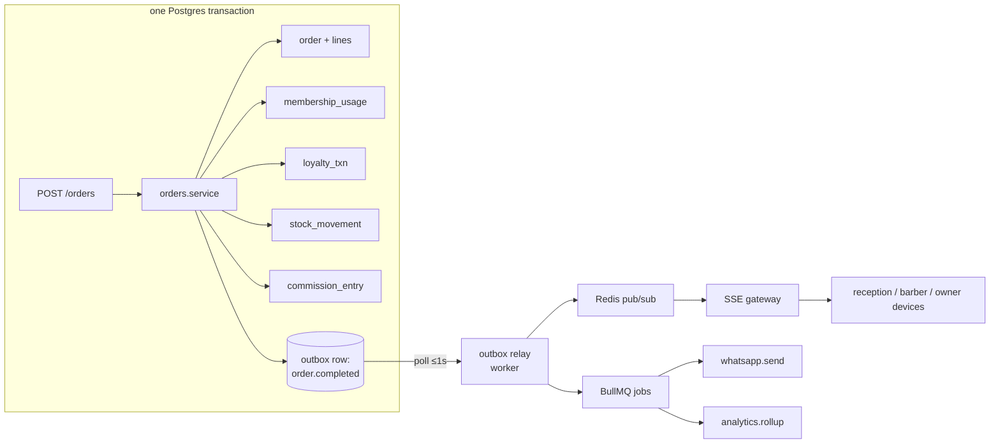
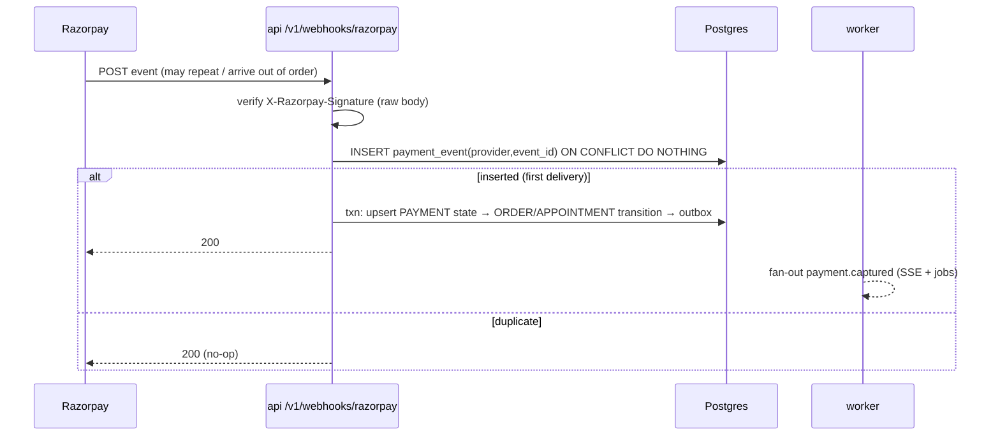
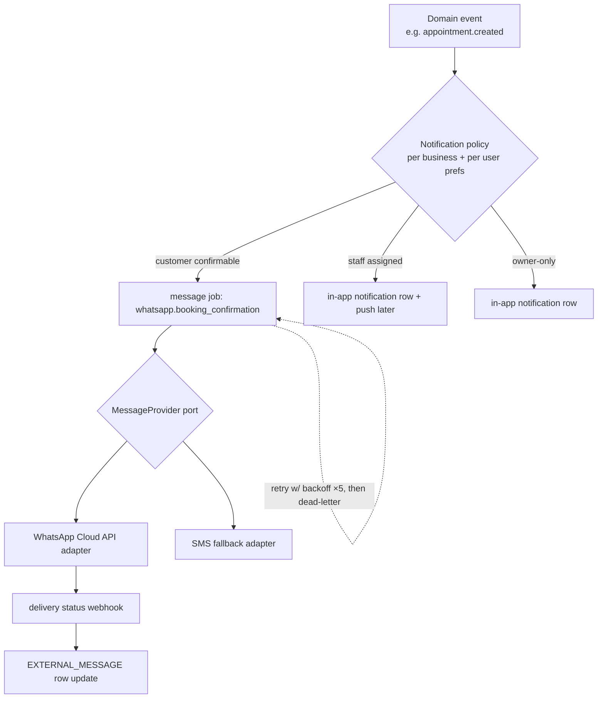

# Realtime & Events

> In the demo, cross-role sync is free: all six personas share one
> localStorage. Production replaces that with (a) transactional domain events
> inside the monolith, (b) an outbox for reliable async work, and (c) SSE for
> device fan-out. This doc defines all three and draws the important flows.

## 1. What genuinely needs realtime (audited)

Walking the demo screens, only these views go stale in a way that matters
operationally within seconds:

| View | Staleness pain | Event(s) |
|---|---|---|
| Reception queue / Today | new booking, check-in, start/complete, walk-in | `appointment.created/checked_in`, `service.started/completed`, `queue.updated` |
| Barber Today/Queue | next customer arrived, assignment | same |
| Customer live queue tracker (`/customer/bookings/[id]`) | position/ETA changes | `queue.updated` |
| POS "ready for checkout" | completion lands | `service.completed` |
| Owner live-shop card | chair states | `queue.updated` (low frequency ok) |

Everything else (analytics, inventory lists, CRM, marketing, admin) is fine
with fetch-on-navigate + 30–60s cache. **Do not push every mutation.**

## 2. Transport decision

| Option | Verdict |
|---|---|
| WebSockets | bidirectional not needed (all writes go through REST); extra infra care on proxies |
| Managed (Pusher/Ably) | fine product, but another vendor + per-message pricing for ~5 event types; unnecessary when we run a long-lived Node process anyway |
| Polling only | acceptable fallback; 5–10s polling of `/queue` would actually suffice at 10 shops — but SSE is nearly free for us |
| **SSE** ✅ | one-way, HTTP-native, works through Fly's proxy, auto-reconnect built into `EventSource`, trivially multi-instance with Redis pub/sub |

**Design:** `GET /v1/businesses/:b/branches/:br/events` (SSE, auth +
membership-checked). Channel key `biz:{b}:branch:{br}`. Customers get a
narrower stream: `GET /v1/me/appointments/:id/events`. Events carry **ids and
types only** (`{type, entityId, at}`) — clients respond by invalidating the
matching TanStack Query keys and refetching the small REST projections. This
keeps events tiny, avoids leaking data past permission filters, and means a
missed event only costs one refetch (plus a 30s safety refetch interval on
queue screens).

## 3. Event catalog

```text
appointment.created | .cancelled | .rescheduled | .checked_in | .no_show
service.started | service.completed
queue.updated                       (coalesced: emitted after any of the above at a branch)
order.completed                     (invoice finalized)
payment.captured | payment.failed | payment.refunded
inventory.low_stock                 (threshold crossing only, not every movement)
inventory.restocked
leave.requested | leave.approved | leave.rejected
waitlist.slot_opened
membership.renewal_due              (job-emitted)
campaign.dispatch_requested
```

Payload convention:
```json
{ "id": "evt_01H…", "type": "service.completed", "businessId": "biz_…",
  "branchId": "br_…", "entity": { "appointmentId": "apt_…" },
  "occurredAt": "2026-08-21T17:58:03+05:30", "actorMembershipId": "mem_…" }
```

## 4. Transactional vs async (the ServiceCompleted / OrderCompleted question)

The demo's `completeService` + `checkout` collapse many effects into one
synchronous mutation. Production splits by **consistency requirement**:

**Two distinct transactions — no side effect runs in both**
(full table in DOMAIN_MODEL.md §5):

*Service-completion transaction:*
- appointment `in_service→completed` (status-guard `WHERE`)
- STOCK_MOVEMENT rows of kind `service_consumption` (+ cached qty)
- outbox `service.completed` (drives "ready for checkout")

*Checkout/order transaction:*
- ORDER + ORDER_LINEs + totals + receipt number allocation
- PAYMENT state changes / advance allocation
- MEMBERSHIP_USAGE rows
- LOYALTY_TXN rows — redeem and earn (+ cached balance)
- STOCK_MOVEMENT rows of kind `product_sale` only
- COMMISSION_ENTRY rows (rule snapshot)
- outbox `order.completed`

Both end with the **outbox row insert in the same txn** — the reliability hinge.

**Async via outbox → jobs (retryable, eventually consistent):**
- WhatsApp/SMS/push messages
- SSE fan-out (publish to Redis after commit; outbox relay covers crashes)
- analytics aggregates / materialized view refresh
- campaign deliveries
- webhooks to future integrations
- low-stock detection notification



Outbox rows are marked processed exactly-once by the relay (row lock +
processed_at); handlers are idempotent anyway (job ids = event ids).

## 5. Production cross-role flow (the storyline, distributed)

```mermaid
sequenceDiagram
    autonumber
    participant CP as Customer phone
    participant API as api (Fly bom)
    participant DB as Postgres
    participant RZ as Razorpay
    participant W as worker
    participant RT as Reception tablet
    participant BP as Barber phone
    participant OP as Owner phone

    CP->>API: GET availability
    API->>DB: engine inputs (hours, shifts, leave, appts)
    API-->>CP: slots (advisory)
    CP->>API: POST appointments (Idempotency-Key)
    API->>DB: INSERT appointment (EXCLUDE gist guards overlap)
    API->>RZ: create order ₹100 advance
    API-->>CP: appointment pending_payment + intent
    CP->>RZ: UPI collect approve
    RZ-->>API: webhook payment.captured (sig verified, event de-duped)
    API->>DB: payment captured; appointment → confirmed; outbox
    W-->>RT: SSE appointment.created → refetch today/queue
    W-->>CP: WhatsApp confirmation (job)

    RT->>API: POST /appointments/:id/check-in
    API->>DB: status guard confirmed→checked_in; queue_position; outbox
    W-->>BP: SSE queue.updated
    W-->>CP: SSE (customer stream) — live tracker position

    BP->>API: POST /appointments/:id/start
    API->>DB: checked_in→in_service
    BP->>API: POST /appointments/:id/complete
    API->>DB: in_service→completed + stock consumption + outbox
    W-->>RT: SSE service.completed → "ready for checkout"

    RT->>API: POST /orders/preview → server math
    RT->>API: POST /orders (Idempotency-Key, cash+upi split)
    API->>DB: txn: order/lines/usage/loyalty/stock/commission/receipt + outbox
    API-->>RT: invoice
    W-->>OP: SSE order.completed → dashboard revenue refetch
    W-->>CP: WhatsApp receipt + review ask (job, delayed)
```

## 6. Payment webhook flow


Reconciliation job (nightly): pull provider payment list for the day, diff
against PAYMENT, alert on mismatch.

## 7. Notification pipeline



- Policy layer decides channel + template + language (demo's `Language` on
  customer feeds template locale — Malayalam templates are a real
  differentiator).
- `EXTERNAL_MESSAGE(id, job_id, channel, template, to, provider_ref, status,
  error)` gives auditable delivery history.
- Booking logic never calls WhatsApp directly — it only emits events.

## 8. Background job inventory

| Job | Trigger | Schedule |
|---|---|---|
| outbox.relay | poll | continuous (≤1s) |
| whatsapp.send / sms.send | event | on demand + retries |
| appointment.reminder | cron scan | every 5 min (T-60min window, per-business config) |
| appointment.expire_pending_payment | cron | every minute; status-guarded flip `pending_payment→expired`, which removes the row from the overlap-exclusion set and frees capacity |
| queue.abandon_check | cron | every 10 min (checked_in > X min, flag for no-show) |
| waitlist.notify | `appointment.cancelled` | on demand |
| membership.renewal | cron daily | renewal_due events + status flips |
| analytics.daily_rollup | cron nightly | per business/branch day aggregates |
| payments.reconcile | cron nightly | provider diff |
| campaign.dispatch | `campaign.dispatch_requested` | batched sends w/ rate caps |
| segments.refresh | cron nightly | inactive-30/60, VIP recompute |
| cleanup | cron | expired sessions, old outbox rows |

All BullMQ on Upstash Redis; the worker is the same codebase (`apps/api`)
started with a `WORKER=1` env — no separate deployment artifact.

## 9. Frontend consumption pattern

```text
EventSource(/branches/:br/events)
   └─ onmessage(type) → queryClient.invalidateQueries(byType[type])
TanStack Query keys: ['queue', br], ['appointments', br, day], ['dashboard', b, br, day] …
Fallback: refetchInterval 30s on queue/today screens; SSE reconnect w/ Last-Event-ID.
```

Optimistic updates only for low-risk commands (check-in, start) with rollback
on 409; money commands (checkout, payment) are never optimistic.
