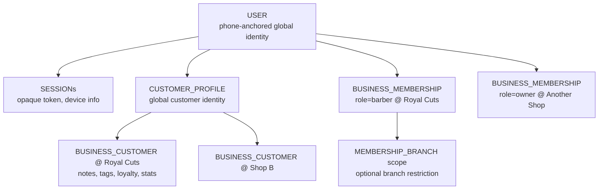
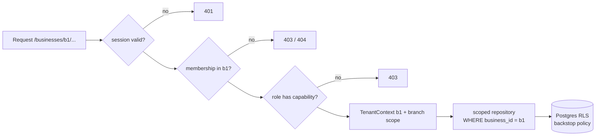

# Security & Tenancy

> The demo's `lib/personas.ts` PERMISSIONS matrix and the role-scoped route
> areas are the product spec for authorization. The demo enforces none of it
> (any client can mutate anything in localStorage) — production enforces all
> of it server-side. Frontend route hiding remains UX only.

## 1. Identity model

- One human = one USER (phone). Roles are **memberships**, not user columns.
  A person can simultaneously be a customer of many shops, a barber at one and
  an owner of another — the demo's persona switcher becomes a membership/
  context switcher.
- `CUSTOMER_PROFILE` is global (marketplace-ready); `BUSINESS_CUSTOMER` is the
  tenant-owned relationship (see DOMAIN_MODEL.md §1). Shop-created walk-in
  customers may have `customer_profile_id = NULL` until the phone number
  later claims them (claim = OTP verification against that number).

## 2. Authentication

| Audience | Primary | Notes |
|---|---|---|
| Customers | **Phone OTP** (SMS; WhatsApp-OTP as cheaper second channel) | zero-friction target market; no passwords ever |
| Staff/owners | Phone OTP + optional email+password; Google optional later | same login screen, higher session assurance below |
| Platform admins | Email + password + TOTP 2FA, separate `/admin` realm | never OTP-only |

**Sessions:** DB-backed opaque tokens (random 256-bit), stored hashed.
Web: httpOnly + Secure + SameSite=Lax cookie. Session row: user_id, device
label, UA, IP, created_at, last_seen_at, expires_at, revoked_at.
- Customer sessions: 90-day sliding.
- Business sessions: 14-day sliding + step-up (fresh OTP ≤ 15 min) for
  sensitive actions: refunds, register close adjustments, staff permission
  changes, payout settings.
- `POST /auth/logout-all` revokes all rows; `GET /auth/sessions` lists devices
  (both trivially supported by the table).

**OTP hardening:** 6 digits, 5-min TTL, hashed at rest; max 5 verify attempts
per code; request rate limits per phone (3/10min, 10/day) **and** per IP;
Redis-backed counters; resend cooldown 30s; generic error messages (no user
enumeration); cost alarm on daily OTP spend.

## 3. Authorization (RBAC)

Production keeps the demo's four business roles + platform admin. Permission
matrix (derived from `PERMISSIONS` in `lib/personas.ts`, tightened):

| Capability | barber | receptionist | manager | owner |
|---|---|---|---|---|
| View own schedule/queue/customers-served | ✅ | ✅ | ✅ | ✅ |
| Start/complete/no-show own appointments | ✅ | ✅ | ✅ | ✅ |
| Customer notes/preferences (service-relevant) | ✅ | ✅ | ✅ | ✅ |
| Create/cancel/reschedule bookings, walk-ins, check-in | ❌ | ✅ | ✅ | ✅ |
| POS checkout, payments, register | ❌ | ✅ | ✅ | ✅ |
| Own earnings/commission statements | ✅ | ❌ | ❌ | ✅ (all) |
| Staff CRUD, shifts, leave approval | ❌ | ❌ | ✅ (branch) | ✅ |
| Inventory & POs | ❌ | ❌ | ✅ (branch) | ✅ |
| Marketing, offers, campaigns | ❌ | ❌ | ❌ | ✅ |
| Financial reports, expenses, payroll, billing | ❌ | ❌ | branch-summary only | ✅ |
| Business settings, integrations, permissions | ❌ | ❌ | ❌ | ✅ |

Enforcement: NestJS guard chain
`AuthGuard → MembershipGuard(businessId from URL) → PermissionGuard(capability)`
→ handlers receive a `TenantContext { businessId, branchScope, membership }`.
Branch-scoped roles (manager, receptionist, barber) get `branchScope` from
`MEMBERSHIP_BRANCH`; repositories apply it on every query.

## 4. Tenant isolation — three layers

1. **Request guard**: URL businessId must match an active membership (or a
   customer-relationship for `/me` flows). 403 otherwise; 404 for ids that
   exist in other tenants (no existence oracle).
2. **Scoped repositories** (primary): every tenant table query goes through a
   repository that *requires* `TenantContext` and appends
   `WHERE business_id = $ctx.businessId` (+ branch scope). No raw query
   escape hatch outside the analytics module's reviewed queries.
3. **Postgres RLS backstop**: `ALTER TABLE … ENABLE ROW LEVEL SECURITY` with
   policy `business_id = current_setting('app.business_id')::uuid`; the API
   sets `SET LOCAL app.business_id` per transaction. A repository bug then
   returns zero rows instead of another tenant's data. Platform-admin paths
   use a separate DB role with a `BYPASSRLS`-equivalent policy + mandatory
   audit row.

Cross-tenant uniqueness traps to avoid: receipt numbers, coupon codes, staff
"colors", customer phone — all unique **per business**, never globally.

## 5. Data visibility per persona (PII minimization)

Audited against what each demo screen actually shows, then tightened:

| Data | barber | receptionist | manager | owner | platform support |
|---|---|---|---|---|---|
| Customer name, preferences, service notes, visit history | ✅ | ✅ | ✅ | ✅ | on grant |
| Customer phone | tap-to-call/WhatsApp action, **masked at rest in UI** (`+91 98xxx xx090`) | full (they dial) | full | full | masked |
| Customer lifetime spend | ✅ (demo shows it; keep — it drives service quality) | ✅ | ✅ | ✅ | ❌ |
| Other staff's earnings/commissions | ❌ (API filters to self) | ❌ | branch aggregate | ✅ | ❌ |
| Business financials, expenses, payroll | ❌ | ❌ | branch summary | ✅ | ❌ |
| Payment instrument details | nobody — we never store PANs/VPAs beyond provider refs | | | | |

API responses are **role-shaped**: the same `/customers/:id` returns a
narrower DTO for barbers than owners (separate zod response schemas per
capability, not client-side hiding).

## 6. Platform admin & support impersonation

- `/admin` is a separate NestJS module + separate session realm; admin
  accounts live outside tenant memberships.
- "View as owner" (demo button) becomes **time-boxed impersonation grants**:
  support requests grant → owner receives WhatsApp/in-app approval (or grant
  is auto-approved for trial tenants with disclosure) → grant row
  `(admin_id, business_id, expires_at ≤ 60min, reason)` → every request under
  impersonation writes AUDIT_LOG rows flagged `impersonated=true`.
- Admin actions on tenants (plan change, suspension, payment retry) always
  audit-log.

## 7. Audit strategy

Two tiers (matches §27 of the brief):
- **Domain history tables** where the timeline is product-visible:
  `APPOINTMENT_EVENT`, `PAYMENT_EVENT`, `STOCK_MOVEMENT`, `LOYALTY_TXN`,
  `COMMISSION_ENTRY`, `EXTERNAL_MESSAGE`, `QUEUE` transitions inside
  APPOINTMENT_EVENT.
- **Generic AUDIT_LOG** for config/authz mutations: staff role changes,
  permission edits, price changes, register close adjustments, refunds,
  membership plan edits, leave decisions, impersonated actions.
  `(id, business_id?, actor_user_id, actor_type, action, entity, entity_id,
  before jsonb, after jsonb, ip, at)` — append-only, no UPDATE grant.

## 8. Application security checklist (enforced in code review + CI)

- Input validation: every route body/query parsed by zod contract; unknown
  keys stripped.
- SQLi: Drizzle parameterized everywhere; raw SQL only in migrations +
  reviewed analytics queries.
- XSS: React default escaping; no `dangerouslySetInnerHTML`; CSP headers on
  web (`next.config` headers) — nonce-based script policy.
- CSRF: SameSite=Lax cookie + custom `X-Requested-With` check on state
  mutations (belt) — API also accepts Bearer for non-browser clients.
- Webhooks: raw-body signature verification (Razorpay HMAC, WhatsApp
  `X-Hub-Signature-256`), timestamp tolerance, event-id dedupe (replay-safe).
- Rate limits (Redis): auth endpoints (strict), availability (per IP),
  booking creation (per customer), global per-token ceiling.
- Secrets: Fly secrets + Vercel env; no secrets in the repo; separate
  staging/production credentials; quarterly rotation checklist.
- PII in logs: structured logger with redaction list (phone, otp, tokens,
  provider payloads trimmed); request-id on every line.
- File uploads (logos): R2 presigned PUT, content-type allowlist, size cap,
  image re-encode on ingest.
- Backups: Supabase PITR + weekly logical dump to R2; restore drill each
  quarter (documented runbook).
- Dependency & secret scanning: GitHub Dependabot + gitleaks in CI.

## 9. Demo-mode security note

`/demo` remains a pure client-side mock (see DEMO_TO_PRODUCTION_MIGRATION.md).
It must never hold a real session: the demo bundle ships without API
credentials, and the API refuses demo-tenant writes from production web
origin if a seeded demo tenant is later introduced (separate business flagged
`is_demo`, excluded from billing/analytics/exports, nightly reset job).
